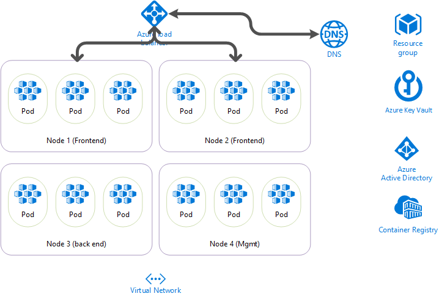

# Bootstrap Development Environment

CI/CD pipeline will use a service principal that have access to azure Key Vault and azure resource group. Developers must be granted access to AAD app before running local devbox.

Service principal is granted access to Key Vault via certificate (not password).



## Instruction

__for demo purpose, I will use personal azure subscription so that I can assign roles to AAD app__

1. create key vault with name helloworld_dev_xiaodoli_kv
2. create a self-signed certificate (cn=helloworld_dev_xiaodoli_sp) and add it to key vault
3. create AAD app with id helloworld_dev_xiaodoli_sp and use cert for credential
4. grant current user access to AAD app (only needed for local devbox setup, CI/CD pipeline will use the same service principal)

## Create Self-Signed Certificate

__this is only for dev/test, production certificate will be created from trusted CA and then imported to Key Vault__

1. Create resource group and key vault 
``` bash
location="westus2"
loc="wus2"
subscriptionName=BizSpark-xdxli
productName=helloworld
productShortName=hw
envName=dev
rand=xiaodoli
currentUserPrincipalName=lingxd_gmail.com#EXT#@xdxlioutlook.onmicrosoft.com

az login
az account set -s $subscriptionName
rgName=${productName}-${envName}-${rand}-${loc}-rg
az group create -n $rgName -l $location

kvName=${productShortName}-${envName}-${rand}-kv # make sure vault name length <= 24
kvNameSize=${#kvName}
if [ $kvNameSize \> 24 ]; then 
    echo "Error: pick different valut name"
    exit 1
else 
    echo "Vault name is $kvName"
fi
az keyvault create -g $rgName -n $kvName -l $location
```

2. Create certificate
``` bash
certName=${productName}-${envName}-${rand}-${loc}-sp
az keyvault certificate create -n $certName --vault-name $kvName \
-p "$(az keyvault certificate get-default-policy)"

```

3. Create service principal for RBAC
``` bash
subscriptionId=$(az account show --query id -o tsv)
userName=$(az account show --query user.name)
spName=${productName}-${envName}-${rand}-${loc}-sp

az ad sp create-for-rbac -n $spName --role contributor \
--keyvault $kvName --cert $certName 

az ad sp show --id http://${spName}
aadAppId=$(az ad sp show --id http://${spName} --query appId -o tsv)
aadObjId=$(az ad sp show --id http://${spName} --query objectId -o tsv)
```

4. Grant current user to AAD role
``` bash
az role assignment create --assignee $aadAppId --role Contributor
# which one??
# az role assignment create --assignee $aadObjId --role Contributor
```
